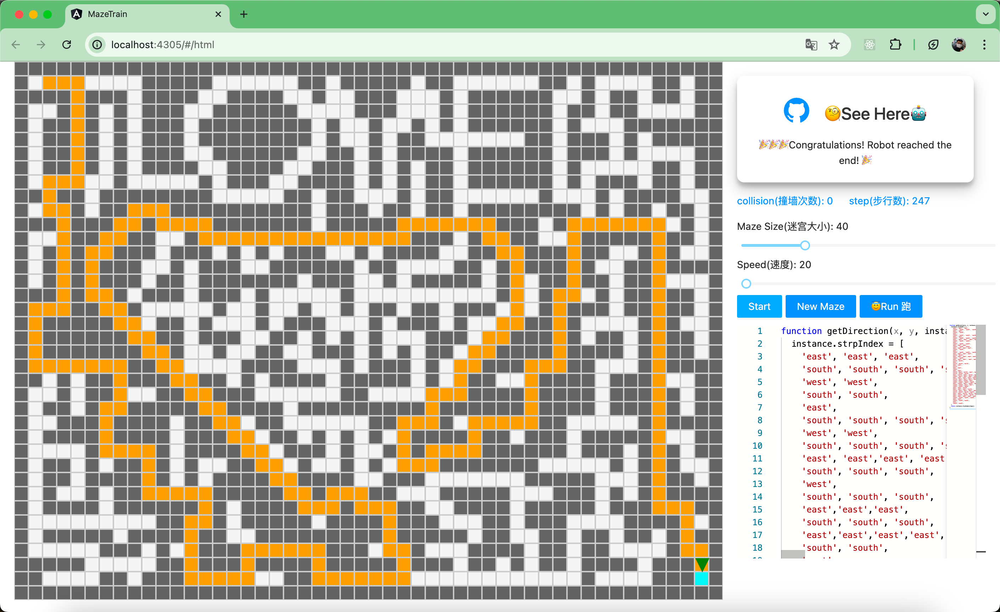
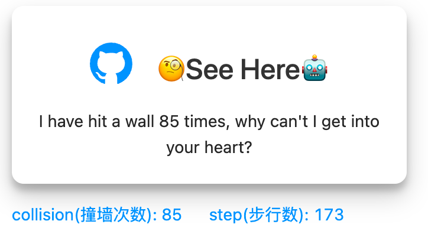

# eawesome-maze

[简体中文](./README_ZH.md) | English



This project is inspired by [this project](https://github.com/mbg/maze), and I have implemented the maze in the web using Angular. The project allows you to control the maze direction by writing functions and generate mazes by creating your own 2D arrays. You can get a preview by clicking the links below.

- [HTML implementation with absolute positioning (recommended)](https://advancedproductivity.github.io/awesome-maze/#/html)
- [Canvas implementation](https://advancedproductivity.github.io/awesome-maze/#/canvas)

## HTML Implementation

The HTML version uses flexbox for maze layout and absolute positioning to draw the maze. This makes it easy to control the robot's position, which is represented by a triangle.

It is implemented using SVG.

This version has scrolling issues when the maze is large.

## Canvas Implementation

I tried implementing the maze with canvas, but the more I worked on it, the more it felt like creating a map.

If the maze is particularly large, it will be a very large 2D array. While working on it, I naturally thought about whether I could render only a portion of the array like a map, but this was very time-consuming for me, so I did not implement it.

## Custom Function to Control Robot Direction

The following function can be compiled on the webpage, and you should be able to see it in the bottom right corner of the link.

```js
function getDirection(x, y, instance, lookUp, haveBeen, steps) {
    console.log('x is', x);
    console.log('y is', y);
    console.log('instance is', instance);
    console.log('step is', steps);
    console.log('west is wall?', lookUp('west'));
    console.log('was east have been there ', haveBeen('west'));
    return 'north';
}
```

- The function returns the robot's direction, which can be `north`, `south`, `west`, or `east` (yes, four strings).
- x and y are the robot's coordinates (the indices of the 2D array).
- instance is an object used to record contextual information, which is essential for recursive tree data structures.
- lookUp is a function that takes a direction string and returns a boolean indicating whether there is a wall in that direction.
- haveBeen is a function that takes a direction string and returns a boolean indicating whether the next coordinate in that direction has already been visited.
- steps is a number representing the number of steps the robot has taken.

## Additional Information

1. You can click the button on the demo desktop to start the robot. By default, it randomly chooses a direction without any memory function, making it appear very clumsy.
2. The first maze image you see has a heart-shaped design, which I manually generated using a concept similar to a map editor. You can click `New Maze` to generate a new map.

As you can see, the first maze has a default heart shape. I designed this maze, and you have to walk a loop from the "heart" to find the exit.

This maze has no loops, and you can view the full exit path for this maze in the function here: [maze/src/app/heatMaze.route.js](https://github.com/AdvancedProductivity/maze-training-ground/blob/d4684524ca0cf4a7d16f9d5d703f96d33b09457a/maze/src/app/heatMaze.route.js)

You can copy it and compile it on the webpage to see how the robot moves.

## Query Parameters

This maze can amuse your friends. You can enter a `query` parameter in the webpage and share it with your friends. The person who opens the link will see the text you set.

For example:
```HTTP
https://advancedproductivity.github.io/awesome-maze/#/html?q=I have hit the wall __ times, why can't I get into your heart.
```
Note: url encoder

Note that two consecutive underscores `__` will be replaced with a component parameter, as shown in the image below:



## Future Plans

I wrote this project in one day on a free Sunday, thanks to ChatGPT. If I have time in the future, I plan to improve the following:

- [ ] Refactor the code, it's a bit messy
- [ ] Implement partial rendering with canvas
- [ ] Implement maze generation using online scripts with JS
- [ ] Provide more algorithms
- [ ] Provide more shortcut operations to quickly edit and generate interesting mazes
