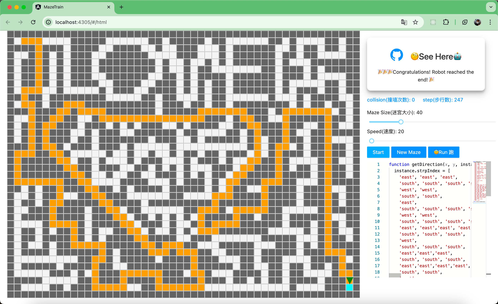
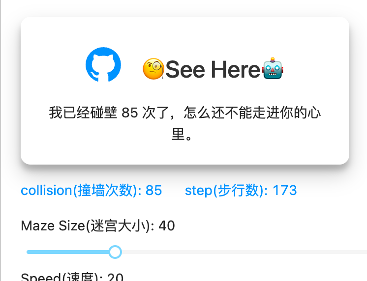

# awesome-maze



这个项目受到了[这个项目](https://github.com/mbg/maze）的启发，我用Angular在web端来实现迷宫。
该项目可以通过编写函数控制迷宫走向，还可以通过自己生成二维数组来生成迷宫。
您可以点击下面的链接先睹为快。

- [Html基于绝对布局的实现(建议)](https://advancedproductivity.github.io/awesome-maze/#/html)
- [Canvas的实现](https://advancedproductivity.github.io/awesome-maze/#/canvas)

## Html 的实现
 Html 用 flex 画迷宫布局，然后使用绝对布局来画迷宫。这样可以很方便的控制机器人的位置，机器人用一个三角形代替。
 
它是用 svg 实现的。

这个版本在迷宫较大时会有滚动问题。

## Canvas 的实现

我尝试用 canvas 实现，但是越做越发现跟做地图差不多。

如果是一个特别大的迷宫，那么他会是一个特别大的二维数组，我在做的时候自然而然想到是否可以像地图一样，
只绘制局部的数组，这对我来说很耗时间，所以没有实现。

## 自定义函数控制机器人走向

下面的函数可以在网页上进行编译，您应该能在链接右下角看到。

```js
function getDirection(x, y, instance, lookUp, haveBeen, steps) {
    console.log('x is', x);
    console.log('y is', y);
    console.log('instance is', instance);
    console.log('step is', steps);
    console.log('west is wall?', lookUp('west'));
    console.log('was east have been there ', haveBeen('west'));
    return 'north';
}
```

- 该函数返回的是机器人的方向，可以是`north`、`south`、`west`、`east`(是的，四个字符串)。
- x 和 y 是机器人的坐标(也就是 二维数组的下标)。
- instance 是一个对象，是用来给开发者记录上下文信息，这在递归树的数据结构时是必不可少的。
- lookUp 是一个函数，传入一个方向的字符串，返回一个布尔值，表示这个方向是否有墙。
- haveBeen 是一个函数，传入一个方向的字符串，返回一个布尔值，表示这个方向的下一步坐标是否已经走过。
- steps 是一个数字，表示机器人已经走了多少步

## 其他
1. 您可以点击demo桌面上的按钮，让机器人开始走，它默认是随机挑选方向，没有任何记忆功能，显得非常笨重。
2. 您看的第一张迷宫图，有心形团的设计，它是我用类似地图编辑器的概念手动生成的，您可以点击 `New Maze`生成一张新地图。


正如您所见，第一张迷宫默认会有一个心形图，这张迷宫是我设计的，它必须要从「心」中走一圈才能找到出口

这个迷宫没有环，您可以在查看这个函数看到该迷宫完整的出口路径：[maze/src/app/heatMaze.route.js](https://github.com/AdvancedProductivity/maze-training-ground/blob/d4684524ca0cf4a7d16f9d5d703f96d33b09457a/maze/src/app/heatMaze.route.js)

您可以复制它，然后在网页上编译，看看机器人是如何走的。

## 查询参数

这个迷宫可以逗朋友开心的，可以在网页输入一个 `query` 参数，然后分享给朋友，打开链接的人会看到您设置的文本。

例如：
```shell
https://advancedproductivity.github.io/awesome-maze/#/html?q=我已经碰壁__次了，怎么还不能走进你的心里。
```

请注意，两个连续的下划线`__`会被替换成一个组件参数，如下图：





## 后续

这个项目是我空闲周日一天写的，感谢ChatGPT。后面如果有时间完善以下：

- [ ] 重构代码，写的有点烂
- [ ] 用 canvas 实现局部绘制
- [ ] 用 js 在线脚本实现迷宫的生成
- [ ] 提供更多的算法
- [ ] 提供更多的操作快捷编辑生成有意思的迷宫
